# Requirements (em construção)

Pasta contendo os artefatos de Requisitos Funcionais e não-Funcionais do projeto.

graph LR
    A[Square Rect] -- Link text --> B((Circle))
    A --> C(Round Rect)
    B --> D{Rhombus}
    C --> D

